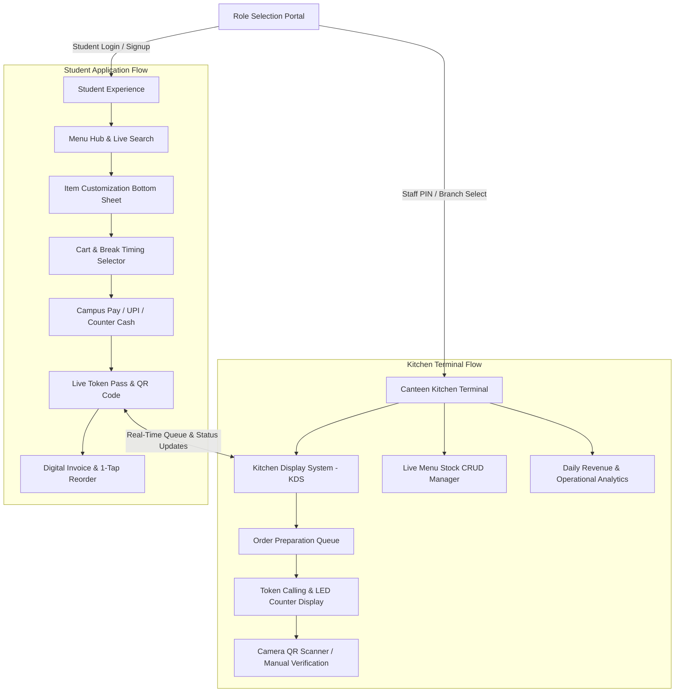
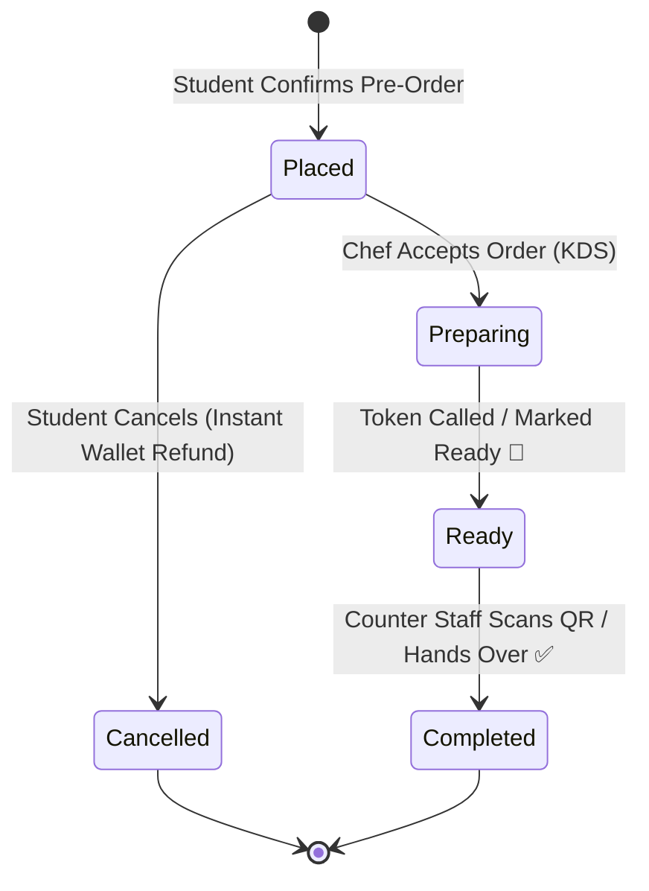

# ⚡ QLess — Smart Queue-Less Campus Canteen Pre-Order System

<p align="center">
  
</p>

<p align="center">
  <strong>Skip the lines, savor the time.</strong><br>
  A modern, high-performance, queue-less pre-order & kitchen display management system designed for campus canteens and food courts.
</p>

<p align="center">
  
  
  
  
  
</p>

---

## 📌 Table of Contents
1. [Overview & Problem Statement](#-overview--problem-statement)
2. [Key Feature Matrix](#-key-feature-matrix)
3. [System Architecture & Workflow](#-system-architecture--workflow)
4. [User Flow & Operational Guidance](#-user-flow--operational-guidance)
5. [Project Directory Structure](#-project-directory-structure)
6. [Getting Started & Installation](#-getting-started--installation)
7. [Demo Accounts & Test Presets](#-demo-accounts--test-presets)
8. [Testing & Quality Assurance](#-testing--quality-assurance)
9. [Future Roadmap](#-future-roadmap)

---

## 💡 Overview & Problem Statement

College lunch breaks typically last between **30 to 45 minutes**, but students routinely spend **20+ minutes waiting in long canteen lines** just to order and pay, followed by chaotic counter crowds while waiting for food.

**QLess** solves this campus bottleneck by introducing an end-to-end queue-less food ecosystem:
- **For Students**: Browse multiple canteen menus, customize orders, schedule pickup slots for break time, pay with one-tap Campus Wallet, and track their preparation queue live with a digital QR pickup pass.
- **For Canteen Staff & Kitchen**: A real-time **Kitchen Display System (KDS)** Kanban board, token calling counter display, live stock availability toggles, camera QR scanner verification, and daily sales analytics.

---

## ✨ Key Feature Matrix

### 🎓 Student Experience
- **Multi-Canteen Discovery Hub**: Switch between campus branches (Central Food Court, Tech Park Cafe, Healthy Green Spot).
- **Smart Menus & Search**: Real-time text search, horizontal category carousels (`South Indian`, `Meals`, `Snacks`, `Beverages`, etc.), `Pure Veg 🟢` toggle, and `Bestsellers ⭐` filters.
- **Item Customization Modal**: Bottom sheet to specify custom chef instructions (*"Less spicy"*, *"No ice"*), inspect spice levels, and view calories.
- **Smart Scheduled Pickup**: Choose between **⚡ ASAP (~10-12 mins)** or **⏰ Schedule for Break Time** (Lunch / Tea break presets).
- **Campus Pay Wallet**: Zero-fee instant digital wallet with balance indicators and 1-tap quick top-up simulation (`+₹100`, `+₹200`, `+₹500`).
- **Live Queue Stepper & Token Pass**: Real-time token number (e.g. `#TK-108`), queue depth (*"2 orders ahead of you"*), currently serving token, and countdown wait estimates.
- **Digital QR Pickup Pass**: Scannable on-screen QR pass for zero-friction collection at the counter.
- **Order Cancellation & Instant Refund**: Cancel pending orders before preparation begins with instant wallet balance refund.
- **Order History & Tax Receipts**: View past receipts, trigger 1-tap reordering, and download official itemized digital tax invoices with verification QR code.

### 🍳 Canteen Staff & Kitchen Terminal
- **Live Kitchen Display System (KDS)**: Real-time Kanban board with filters for `Active`, `Incoming Placed`, `Cooking in Kitchen`, `Ready for Pickup`, and `Completed`.
- **1-Tap Kitchen Status Progression**:
  - `Accept & Cook 🍳` ➔ Updates student pass to *In Kitchen*.
  - `Call Token / Mark Ready 🔔` ➔ Alerts student that food is ready at the counter.
  - `Hand Over / Deliver ✅` ➔ Completes the order cycle.
- **LED-Style Token Calling Board**: High-visibility counter display showing all tokens ready for collection.
- **Interactive Camera QR Scanner**: Viewfinder scanner with animated laser beam to verify student passes in 1 tap.
- **Live Menu & Stock Manager (CRUD)**: Instant `In Stock` / `Sold Out` toggle switches and modal to add new dishes with custom pricing, categories, and prep times.
- **Sales & Operational Analytics**: Real-time revenue counter, total orders served, average preparation duration, and peak hour insights.

---

## 🏛 System Architecture & Workflow

### 1. High-Level Data & State Flow


### 2. Order Lifecycle State Machine


---

## 🚀 User Flow & Operational Guidance

### For Students
1. **Sign In / Sign Up**: Choose **Student Portal**, log in or tap **Auto-Fill Demo Account** (`STU9421`).
2. **Browse & Filter**: Select dishes, filter by `Pure Veg` or categories, and tap any item to add special instructions (e.g., *"Extra chutney"*).
3. **Select Pickup Time**: In the cart, select **⚡ ASAP** or schedule for your break (e.g., **1:15 PM Lunch Break**).
4. **Checkout**: Select **Campus Pay Wallet** for instant 1-tap confirmation.
5. **Track & Collect**: Keep your phone handy to view your Token Number and queue depth. When notified **Ready for Pickup**, walk to the counter and show your **Digital QR Pass**!

### For Canteen Staff
1. **Terminal Sign In**: Choose **Canteen Kitchen Portal**, select your branch (e.g., *Main Food Court*), and enter PIN (`MAIN101`).
2. **Manage Incoming Orders**: In the **Live KDS** tab, tap **Accept & Cook** when starting a dish.
3. **Call Tokens**: When the food is plated, tap **Call Token / Mark Ready**. The student's app will immediately flash green.
4. **Scan & Deliver**: Tap **Scan Camera QR** or enter the token number to verify the student's digital pass and complete the hand-off.
5. **Manage Stock**: If an item runs out during peak rush, switch to **Menu & Stock** and toggle it to **Sold Out** in 1 tap.

---

## 📂 Project Directory Structure

```text
QLess/
├── lib/
│   ├── main.dart                       # App entry point & Supabase initialization
│   ├── role_selection_page.dart        # Portal selector (Student vs Kitchen Terminal)
│   ├── student_login_page.dart         # Student authentication with demo auto-fill
│   ├── student_signup_page.dart        # Student registration with welcome wallet bonus
│   ├── student_home.dart               # 4-Tab Student Discovery Hub & navigation
│   ├── owner_login_page.dart           # Canteen staff branch selection & PIN login
│   ├── owner_home.dart                 # 4-Tab Kitchen Display System & Management
│   │
│   ├── cart/
│   │   ├── cart_controller.dart        # Reactive cart engine & conflict validator
│   │   └── cart_page.dart              # Itemized checkout & scheduled pickup selector
│   │
│   ├── models/
│   │   └── canteen_models.dart         # Canteen, MenuItem, OrderModel, OrderItem, Profile
│   │
│   ├── order/
│   │   └── live_token_tracker_page.dart # Real-time queue tracker & QR pickup pass
│   │
│   ├── services/
│   │   ├── mock_data.dart              # Seed data for canteens & gourmet menu items
│   │   └── order_service.dart          # Reactive queue engine & wallet manager
│   │
│   ├── theme/
│   │   └── app_theme.dart              # Gourmet color palette, typography & tokens
│   │
│   └── widgets/
│       ├── item_detail_bottom_sheet.dart # Cooking instructions modal & spice meter
│       ├── qr_scanner_dialog.dart      # Camera viewfinder QR scanner simulator
│       └── receipt_modal.dart          # Official digital tax invoice generator
│
├── test/
│   └── widget_test.dart                # Widget & integration smoke tests
├── pubspec.yaml                        # Project metadata & dependencies
└── README.md                           # Documentation & user guidance
```

---

## 🛠 Getting Started & Installation

### Prerequisites
- **Flutter SDK**: `3.0.0` or higher ([Install Flutter](https://docs.flutter.dev/get-started/install))
- **Dart SDK**: `3.0.0` or higher
- **Browser or Emulator**: Google Chrome (for web) or Android Studio / Xcode

### Installation Steps

1. **Clone the repository**:
   ```bash
   git clone https://github.com/BLESSEDSAMUELES/QLess.git
   cd QLess
   ```

2. **Install Flutter dependencies**:
   ```bash
   flutter pub get
   ```

3. **Run the application**:
   - **On Chrome Web**:
     ```bash
     flutter run -d chrome
     ```
   - **On Android / iOS device**:
     ```bash
     flutter run
     ```

---

## 🔑 Demo Accounts & Test Presets

| Portal | Role | Identifier / Name | Security Code / Password | Features Included |
| :--- | :--- | :--- | :--- | :--- |
| **Student** | Alex Mercer | `STU9421` | `student@123` | ₹480 Wallet Balance, Active Pre-Orders |
| **Kitchen** | Main Food Court | `Main Food Court (Central)` | `MAIN101` | Full KDS, 8 Dishes, Token Calling |
| **Kitchen** | Tech Park Cafe | `Tech Park Cafe & Bites` | `TECH202` | Sandwich & Shake Bar KDS |
| **Kitchen** | Green Oasis | `Green Oasis Healthy Spot` | `GREEN303` | Healthy Salads & Smoothies KDS |

*💡 Tip: Use the built-in **"Auto-Fill Demo Account"** button on the login screens for 1-tap instant access.*

---

## 🧪 Testing & Quality Assurance

- **Run Static Code Analysis**:
  ```bash
  flutter analyze
  ```
  *(Returns 0 errors and 0 warnings)*

- **Execute Unit & Widget Tests**:
  ```bash
  flutter test
  ```

---

## 🗺 Future Roadmap

- [x] **Phase 1**: Modern Gourmet Design System, Data Models & Reactive State Architecture.
- [x] **Phase 2**: Multi-Canteen Discovery Hub, Dietary Filters & Smart Break Checkout.
- [x] **Phase 3**: Live Token Queue Tracker, Scannable QR Pass & Kitchen Display System (KDS).
- [x] **Phase 4**: Digital Tax Invoice PDF Receipts, Camera QR Simulator & Instant Wallet Refunds.
- [ ] **Phase 5**: Push Notifications via Firebase Cloud Messaging (FCM) on Token Call.
- [ ] **Phase 6**: Bluetooth Thermal Receipt Printer Integration for counter receipt dispensing.

---

## 📄 License
Distributed under the **MIT License**. Feel free to adapt and contribute to campus food digitization!

<p align="center">
  Built with ❤️ for a seamless, queue-free campus dining experience.
</p>
